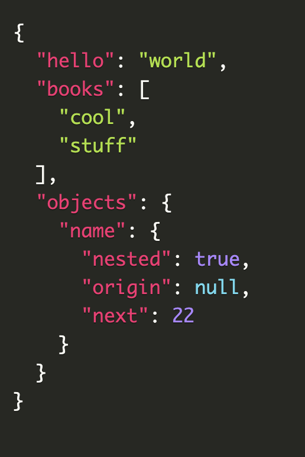

https://github.com/tool3/pj

  
make pretty json using prismjs and query paramters

# description

PJ's single API route allows to create a single HTML page with prismjs already included, making it perfect for `iframe`s and quickly embedding highlighted JSON whether it's on READMEs, blogs, portfolio sites, or anything that can render html.

# usage

use the `/json` path with query parameters to control the content of the returned document.

# `GET /json?key=value`

for example, `https://p-j.herokuapp.com/json?hello=world&books=["cool","stuff"]&objects={"name":{"nested":true,"origin":null,"next":22}}`  
will result in

## all types supported

`pj` supports all the json standard types: `string`, `number`, `boolean`, `null`, `objects` and `arrays`.  
you can even have nested types ! (for example: `["item1", "item2", {"nested": true}]`)

## show line numbers

adding `showLineNumbers=true` will show line numbers on the returned highlighted code block.

## theme

adding `theme=<theme_name>` will use that theme to render the json.  
available themes are the standard prismjs themes, which are:

- `coy`
- `dark`
- `funky`
- `okaidia`
- `solarizedlight`
- `tomorrow`
- `twilight`

note that there is no need to add the `prism-` prefix or any `.css` `.min.css` to the theme name as it is automatically added.
